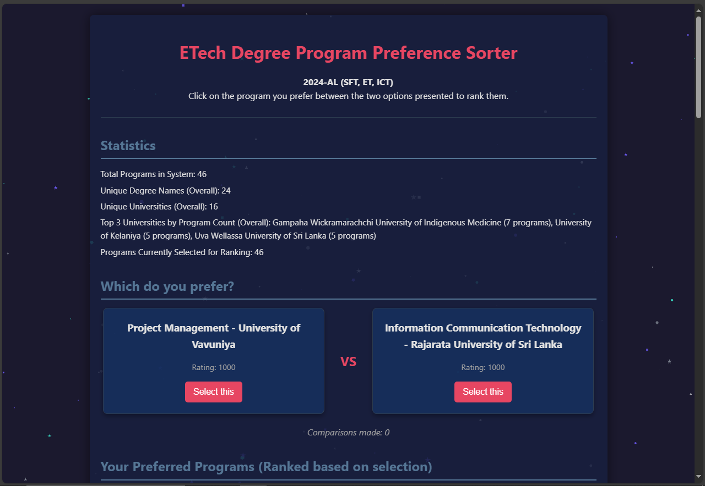

# Degree Preference Sorter (using Elo) 

A client-side web application that allows users to rank degree programs (or any list of items) based on their personal preferences using an Elo-like rating system. Compare two options at a time, and the system will build a dynamically sorted list reflecting your choices.

**This project only has 2024 AL ETech university schoolership couses. (Sri Lanka)**

The current example data focuses on "ETech Degree Programs" in Sri Lanka, but the `initialJsonData` in `script.js` can be easily modified for any set of items you wish to rank.

## 📸 App Screenshot 
<!-- **(Optional: Add a Screenshot/GIF of the application in action here)** -->


## ✨ Features

*   **Side-by-Side Comparison:** Easily choose between two presented options.
*   **Elo-Inspired Rating System:** Program ratings adjust dynamically based on your selections.
*   **Persistent Storage:** Your ratings, selected programs, and comparison count are saved in your browser's local storage, so you can continue where you left off.
*   **Program Selection:** Choose which programs to include in the active ranking pool via the Settings modal.
*   **Customizable Data:** Easily replace the initial program data in `script.js` with your own list of items.
*   **Downloadable Results:** Export your sorted list (including ratings) as a JSON file. Option to include/exclude unselected programs.
*   **Statistics:** View basic statistics about the programs in the system and your selected set.
*   **Reset Functionality:** Clear all ratings, selections, and comparison history.
*   **Visual Feedback:** Sorted list items are color-coded based on their relative ratings.
*   **Copy to Clipboard:** Quickly copy a program's unique code from the sorted list.
*   **Responsive Design:** Usable across different screen sizes.

## 🚀 How it Works

1.  **Initial State:** Each program starts with a default Elo rating (e.g., 1000).
2.  **Comparison:** You are presented with two programs. You select the one you prefer.
3.  **Rating Update:**
    *   The Elo algorithm calculates the expected outcome of the comparison based on the current ratings of the two programs.
    *   The ratings of both the "winner" and "loser" are updated. The winner gains points, and the loser loses points. The magnitude of change depends on the difference in their ratings before the comparison (upsets cause larger shifts).
4.  **Persistence:** All program data (including updated ratings and selection status) and the total number of comparisons made are saved to your browser's `localStorage`.
5.  **Dynamic List:** The ranked list of programs is updated and re-rendered after each comparison.

## 🛠️ Tech Stack

*   **HTML5**
*   **CSS3** (with CSS Variables for theming)
*   **Vanilla JavaScript (ES6+)**

No external libraries or frameworks are used, making it lightweight and easy to understand.

## ⚙️ How to Use

1.  **Clone or Download:**
    ```bash
    git clone https://github.com/AiDarkEzio/Degree-Preference-Elo-Sorter.git
    cd Degree-Preference-Elo-Sorter
    ```
    Or, download the ZIP and extract it.

2.  **Open in Browser:**
    Open the `index.html` file in your preferred web browser.

3.  **Start Ranking:**
    *   You'll be presented with two degree programs in the "Which do you prefer?" section.
    *   Click the "Select this" button under the program you prefer.
    *   The ratings will update, and the "Your Preferred Programs" list will re-sort.

4.  **Manage Settings (Optional):**
    *   Click the "Settings" button.
    *   **Program Selection:** Check/uncheck programs to include/exclude them from the active comparison pool. Use "Select All" or "Deselect All" for convenience.
    *   **Download Options:** Choose whether to include unselected programs in the JSON download.
    *   Click "Apply Settings & Update".

5.  **Download/Reset:**
    *   Click "Download Sorted JSON" to save your ranked list.
    *   Click "Reset All Ratings" to start over (this will clear local storage for this app).

## 🔧 Customization: Using Your Own Data

To use this tool for a different set of items:

1.  Open `script.js` in a text editor.
2.  Locate the `initialJsonData` array at the beginning of the file.
3.  Replace the existing objects with your own data. Each item (object) in the array should ideally have the following structure, though you can adapt the display logic if your fields differ:
    ```javascript
    {
      "degree_code": "UNIQUE_ID_FOR_ITEM", // Used internally as an ID if university_code isn't suitable
      "degree_name": "Primary Name/Title of Item",
      "university_name": "Secondary Name/Subtitle/Category", // Can be adapted
      "university_code": "UNIQUE_ID_FOR_ITEM", // Crucial for identification
      "more_info_link": "/path/to/details?id=UNIQUE_ID_FOR_ITEM", // Link for more details
      "degree_university": "Combined Display Name - e.g., Primary Name - Secondary Name" // Displayed in comparisons and lists
    }
    ```
    *   **`university_code` is critical and must be unique for each item as it's used as the primary ID.**
    *   The `degree_university` field is often a concatenation used for display. Ensure it's descriptive.
4.  Save `script.js` and refresh `index.html` in your browser. The application will initialize with your new data. If you had previous data in local storage from the old dataset, you might want to use the "Reset All Ratings" button to start fresh with your new dataset.

## 💡 Potential Future Enhancements

*   Import/Export program lists directly from the UI (e.g., from a CSV or JSON file).
*   More advanced filtering/sorting options for the main list.
*   Visualizations of rating distributions.
*   User accounts for saving preferences across devices (would require a backend).
*   Option to "skip" a comparison or mark it as "equal preference."

## 📄 License

This project is licensed under the MIT License - see the [LICENSE](LICENSE) file for details.
